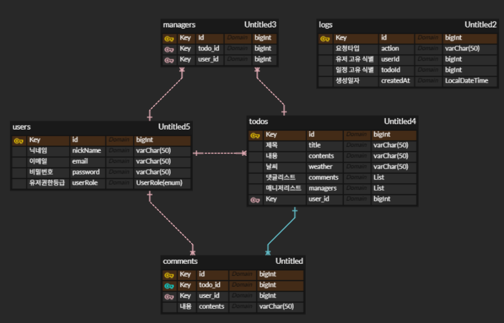

# API 명세서

## USER 개요
- 모든 API는 JWT 인증 필요
    - `/users` 관련 API: 일반 사용자 인증
    - `/admin/users` API: 관리자 권한 필요
- 비밀번호 규칙: 최소 8자, 숫자 포함, 대문자 포함
- 권한 변경 가능 값: `ADMIN`, `USER`

---

## 사용자 정보 조회

- **URL:** `/users/{userId}`
- **Method:** `GET`
- **Auth:** 필요
- **Description:** 특정 사용자의 상세 정보를 조회합니다.

### Request

| Path Variable | Type | Description       |
|---------------|------|-----------------|
| userId        | Long | 조회할 사용자 ID |

### Response (200 OK)

```json
{
  "id": 1,
  "email": "example@example.com"
}
```
| Field | Type   | Description |
| ----- | ------ | ----------- |
| id    | Long   | 사용자 ID      |
| email | String | 사용자 이메일     |

| Code | Description  |
| ---- | ------------ |
| 200  | 조회 성공        |
| 404  | 사용자가 존재하지 않음 |

---

## 비밀번호 변경
- **URL**: /users

- **Method**: PUT

- **Auth**: 필요

- **Description**: 로그인된 사용자가 자신의 비밀번호를 변경합니다.

### Request Body
```json
{
  "oldPassword": "OldPassword123",
  "newPassword": "NewPassword123"
}
```
| Field       | Type   | Description                |
| ----------- | ------ | -------------------------- |
| oldPassword | String | 기존 비밀번호                    |
| newPassword | String | 새 비밀번호 (8자 이상, 숫자와 대문자 포함) |

### Response
- **Body**: 없음

| Code | Description                             |
| ---- | --------------------------------------- |
| 200  | 비밀번호 변경 성공                              |
| 400  | 비밀번호 검증 실패 (규칙 불일치, 기존과 동일, 잘못된 비밀번호 등) |
| 404  | 사용자 없음                                  |

---

## 닉네임 검색
- **URL**: /users

- **Method**: GET

- **Auth**: 필요

- **Description**: 특정 닉네임을 포함하는 사용자 리스트를 조회합니다.

### Request Parameters
| Query Parameter | Type   | Description |
| --------------- | ------ | ----------- |
| nickName        | String | 검색할 닉네임 키워드 |


### Response (200 OK)
```json
[
  {
    "id": 1,
    "email": "example1@example.com"
  },
  {
    "id": 2,
    "email": "example2@example.com"
  }
]
```
| Field | Type   | Description |
| ----- | ------ | ----------- |
| id    | Long   | 사용자 ID      |
| email | String | 사용자 이메일     |

| Code | Description |
| ---- | ----------- |
| 200  | 조회 성공       |
| 404  | 사용자 없음      |

---

## 사용자 권한 변경 (Admin 전용)
- **URL**: /admin/users/{userId}

- **Method**: PATCH

- **Auth**: 관리자 권한 필요

- **Description**: 특정 사용자의 권한을 변경합니다.

### Request
| Path Variable | Type | Description |
| ------------- | ---- | ----------- |
| userId        | Long | 변경할 사용자 ID  |


### Request Body
```json
{
  "role": "ADMIN"
}
```
| Field | Type   | Description           |
| ----- | ------ | --------------------- |
| role  | String | 변경할 역할 (ADMIN / USER) |


### Response
- **Body**: 없음

| Code | Description   |
| ---- | ------------- |
| 200  | 권한 변경 성공      |
| 400  | 유효하지 않은 역할 요청 |
| 404  | 사용자 존재하지 않음   |


### 공통 에러 구조
```json
{
  "message": "에러 메시지 내용",
  "timestamp": "2025-12-29T10:00:00",
  "status": 400
}
```
| Field     | Type   | Description |
| --------- | ------ | ----------- |
| message   | String | 에러 상세 메시지   |
| timestamp | String | 에러 발생 시각    |
| status    | Int    | HTTP 상태 코드  |
---
## TODO 개요
- 모든 API는 JWT 인증 필요
- 비밀번호 규칙 없음 (Todo 관련)
- Todo 관련 API: 로그인 사용자 인증 필요

---

## Todo 등록

- **URL:** `/todos`
- **Method:** `POST`
- **Auth:** 필요
- **Description:** 새로운 Todo를 등록합니다. 등록 시 오늘 날씨가 자동으로 저장됩니다.

### Request Body
```json
{
  "title": "오늘 할 일",
  "contents": "코드 리뷰하기"
}
```
| Field    | Type   | Description |
| -------- | ------ | ----------- |
| title    | String | Todo 제목     |
| contents | String | Todo 내용     |

###Response (200 OK)
```json
{
"id": 1,
"title": "오늘 할 일",
"contents": "코드 리뷰하기",
"weather": "맑음",
"user": {
"id": 1,
"email": "example@example.com"
}
}
```
| Field      | Type   | Description |
| ---------- | ------ | ----------- |
| id         | Long   | Todo ID     |
| title      | String | Todo 제목     |
| contents   | String | Todo 내용     |
| weather    | String | 등록 시 날씨 정보  |
| user       | Object | Todo 작성자 정보 |
| user.id    | Long   | 작성자 ID      |
| user.email | String | 작성자 이메일     |

| Code | Description |
| ---- | ----------- |
| 200  | 등록 성공       |
| 400  | 유효하지 않은 요청  |

---

### Todo 리스트 조회

- **URL**: /todos

- **Method**: GET

- **Auth**: 필요

- **Description**: Todo 목록을 페이징 조회합니다. 날씨, 시작/끝 날짜 조건 필터 가능.

### Request Parameters
| Query Parameter | Type     | Description          |
| --------------- | -------- | -------------------- |
| page            | int      | 페이지 번호 (default 1)   |
| size            | int      | 페이지 사이즈 (default 10) |
| weather         | String   | 날씨 필터 (optional)     |
| start           | DateTime | 조회 시작 시간 (optional)  |
| end             | DateTime | 조회 종료 시간 (optional)  |

### Response (200 OK)
```json
{
"content": [
{
"id": 1,
"title": "오늘 할 일",
"contents": "코드 리뷰하기",
"weather": "맑음",
"user": {
"id": 1,
"email": "example@example.com"
},
"createdAt": "2025-12-29T09:00:00",
"modifiedAt": "2025-12-29T10:00:00"
}
],
"pageable": {},
"totalPages": 5,
"totalElements": 50
}
```
| Field      | Type     | Description |
| ---------- | -------- | ----------- |
| content    | Array    | Todo 리스트    |
| id         | Long     | Todo ID     |
| title      | String   | Todo 제목     |
| contents   | String   | Todo 내용     |
| weather    | String   | 등록 시 날씨 정보  |
| user.id    | Long     | 작성자 ID      |
| user.email | String   | 작성자 이메일     |
| createdAt  | DateTime | 등록 시간       |
| modifiedAt | DateTime | 수정 시간       |

---
### Todo 단일 조회

- **URL**: /todos/{todoId}

- **Method**: GET

- **Auth**: 필요

- **Description**: 특정 Todo의 상세 정보를 조회합니다.

### Request
| Path Variable | Type | Description |
| ------------- | ---- | ----------- |
| todoId        | Long | 조회할 Todo ID |

### Response (200 OK)
```json
{
"id": 1,
"title": "오늘 할 일",
"contents": "코드 리뷰하기",
"weather": "맑음",
"user": {
"id": 1,
"email": "example@example.com"
},
"createdAt": "2025-12-29T09:00:00",
"modifiedAt": "2025-12-29T10:00:00"
}
```
| Code | Description |
| ---- | ----------- |
| 200  | 조회 성공       |
| 404  | Todo 없음     |

---

### Todo 검색
- **URL**: /todos/search

- **Method**: GET

- **Auth**: 필요

- **Description**: 제목, 매니저 닉네임, 생성일 기준으로 Todo를 검색합니다. 페이징 가능.

### Request Parameters
| Query Parameter | Type     | Description          |
| --------------- | -------- | -------------------- |
| keyword         | String   | 제목 키워드 (optional)    |
| managerNickname | String   | 매니저 닉네임 (optional)   |
| start           | DateTime | 조회 시작 시간 (optional)  |
| end             | DateTime | 조회 종료 시간 (optional)  |
| page            | int      | 페이지 번호 (default 1)   |
| size            | int      | 페이지 사이즈 (default 10) |

### Response (200 OK)
```json
{
  "content": [
    {
      "title": "오늘 할 일",
      "managerCount": 2,
      "commentCount": 3
    }
  ],
  "pageable": {},
  "totalPages": 5,
  "totalElements": 50
}
```
| Field        | Type   | Description |
| ------------ | ------ | ----------- |
| title        | String | Todo 제목     |
| managerCount | Long   | 담당 매니저 수    |
| commentCount | Long   | 댓글 수        |

| Code | Description |
| ---- | ----------- |
| 200  | 조회 성공       |
| 404  | Todo 없음     |

---

## MANAGER 개요
- 모든 API는 JWT 인증 필요
- Todo 담당자 관련 API
- Todo 작성자만 담당자를 등록/삭제 가능

---

## 담당자 등록

- **URL:** `/todos/{todoId}/managers`
- **Method:** `POST`
- **Auth:** 필요
- **Description:** 특정 Todo에 담당자를 등록합니다. Todo 작성자만 등록 가능.

### Request

| Path Variable | Type | Description       |
|---------------|------|-----------------|
| todoId        | Long | 담당자를 등록할 Todo ID |

### Request Body
```json
{
  "managerUserId": 2
}
```
| Field         | Type | Description   |
| ------------- | ---- | ------------- |
| managerUserId | Long | 등록할 담당자 유저 ID |

### Response (200 OK)
```json
{
  "id": 1,
  "user": {
    "id": 2,
    "email": "manager@example.com"
  }
}
```
| Field      | Type   | Description    |
| ---------- | ------ | -------------- |
| id         | Long   | 등록된 Manager ID |
| user.id    | Long   | 담당자 유저 ID      |
| user.email | String | 담당자 이메일        |

| Code | Description               |
| ---- | ------------------------- |
| 200  | 담당자 등록 성공                 |
| 400  | Todo 작성자가 아니거나 유효하지 않은 요청 |
| 404  | Todo 또는 등록 대상 유저가 존재하지 않음 |

---

## 담당자 조회

- **URL**: /todos/{todoId}/managers

- **Method**: GET

- **Auth**: 필요

- **Description**: 특정 Todo에 등록된 담당자 리스트를 조회합니다.

### Request
| Path Variable | Type | Description |
| ------------- | ---- | ----------- |
| todoId        | Long | 조회할 Todo ID |

### Response(200 Ok)
```json
[
  {
    "id": 1,
    "user": {
      "id": 2,
      "email": "manager@example.com"
    }
  },
  {
    "id": 2,
    "user": {
      "id": 3,
      "email": "manager2@example.com"
    }
  }
]
```
| Field      | Type   | Description |
| ---------- | ------ | ----------- |
| id         | Long   | Manager ID  |
| user.id    | Long   | 담당자 유저 ID   |
| user.email | String | 담당자 이메일     |

| Code | Description |
| ---- | ----------- |
| 200  | 조회 성공       |
| 404  | Todo 없음     |

---

## 담당자 삭제

- **URL**: /todos/{todoId}/managers/{managerId}

- **Method**: DELETE

- **Auth**: 필요

- **Description**: 특정 Todo에 등록된 담당자를 삭제합니다. Todo 작성자만 삭제 가능.

### Request
| Path Variable | Type | Description |
| ------------- | ---- | ----------- |
| todoId        | Long | Todo ID     |
| managerId     | Long | 삭제할 담당자 ID  |

### Response

- **Body**: 없음

| Code | Description               |
| ---- | ------------------------- |
| 200  | 담당자 삭제 성공                 |
| 400  | Todo 작성자가 아니거나 유효하지 않은 요청 |
| 404  | Todo 또는 Manager 존재하지 않음   |

---

## LOG 개요
- 모든 로그는 내부적으로 기록되며, API로 직접 노출되지 않습니다.
- 담당자 등록 요청 시 로그 기록 기능 포함
- 로그 정보:
    - action: 수행한 액션 명
    - userId: 해당 액션 수행 사용자 ID
    - todoId: 관련 Todo ID
    - createdAt: 로그 생성 시각

---

## 로그 기록 (내부 기능)

- **사용처:** Manager 등록 요청 시 자동 기록
- **서비스:** `LogService.savaManagerLog(userId, todoId)`
- **Auth:** 내부 호출용
- **Description:** 특정 사용자와 Todo에 대한 액션 로그를 기록합니다.

### 저장되는 로그 정보

| Field     | Type      | Description                    |
|-----------|----------|--------------------------------|
| id        | Long     | 로그 ID                        |
| action    | String   | 수행한 액션 이름 (예: "MangerRequest") |
| userId    | Long     | 액션 수행자 사용자 ID           |
| todoId    | Long     | 관련 Todo ID                    |
| createdAt | DateTime | 로그 생성 시각                   |

### 동작 예시 (Manager 등록 시)

```java
logService.savaManagerLog(authUser.getId(), todoId);
```

### 로그 생성 규칙
- Manager 등록 시 항상 새로운 트랜잭션으로 기록

- 로그 기록 실패가 전체 트랜잭션에 영향을 주지 않음 (Propagation.REQUIRES_NEW)

---

## HEALTH CHECK API

- **URL:** `/health`
- **Method:** `GET`
- **Auth:** 불필요
- **Description:** 서버가 정상적으로 동작하는지 확인합니다.

### Request
- **Body:** 없음
- **Query Parameter:** 없음
- **Path Variable:** 없음

### Response (200 OK)
```text
OK
```
---

## COMMENT 개요
- 모든 API는 JWT 인증 필요
- 댓글은 특정 Todo에 대해 작성 및 조회 가능
- 댓글 작성 시 내용은 필수(`NotBlank`)

---

## 댓글 작성
- **URL:** `/todos/{todoId}/comments`
- **Method:** `POST`
- **Auth:** 필요
- **Description:** 로그인된 사용자가 특정 Todo에 댓글을 작성합니다.

### Request

| Path Variable | Type | Description    |
|---------------|------|----------------|
| todoId        | Long | 댓글 작성할 Todo ID |

### Request Body
```json
{
  "contents": "댓글 내용"
}
```

| Field    | Type   | Description |
| -------- | ------ | ----------- |
| contents | String | 댓글 내용 (필수)  |

### Response (200 OK)
```json
{
  "id": 1,
  "contents": "댓글 내용",
  "user": {
    "id": 1,
    "email": "example@example.com"
  }
}
```

| Field      | Type   | Description |
| ---------- | ------ | ----------- |
| id         | Long   | 댓글 ID       |
| contents   | String | 댓글 내용       |
| user       | Object | 댓글 작성자 정보   |
| user.id    | Long   | 사용자 ID      |
| user.email | String | 사용자 이메일     |

| Code | Description |
| ---- | ----------- |
| 200  | 댓글 작성 성공    |
| 404  | Todo 없음     |

---

## 댓글 조회

- **URL**: /todos/{todoId}/comments

- **Method**: GET

- **Auth**: 필요

- **Description**: 특정 Todo에 작성된 댓글 리스트를 조회합니다.

### Request

| Path Variable | Type | Description |
| ------------- | ---- | ----------- |
| todoId        | Long | 조회할 Todo ID |

### Response (200 OK)
```json
[
  {
    "id": 1,
    "contents": "댓글 내용1",
    "user": {
      "id": 1,
      "email": "example1@example.com"
    }
  },
  {
    "id": 2,
    "contents": "댓글 내용2",
    "user": {
      "id": 2,
      "email": "example2@example.com"
    }
  }
]
```
| Field      | Type   | Description |
| ---------- | ------ | ----------- |
| id         | Long   | 댓글 ID       |
| contents   | String | 댓글 내용       |
| user.id    | Long   | 작성자 ID      |
| user.email | String | 작성자 이메일     |

| Code | Description |
| ---- | ----------- |
| 200  | 댓글 조회 성공    |
| 404  | Todo 없음     |

---

## AUTH 개요
- 회원가입 및 로그인 기능 제공
- JWT 토큰 발급
- 이메일 중복 불가, 비밀번호는 평문 -> 암호화 후 저장

---

## 회원가입 (Signup)
- **URL:** `/auth/signup`
- **Method:** `POST`
- **Auth:** 필요 없음
- **Description:** 신규 사용자를 가입시키고 JWT 토큰을 발급합니다.

### Request Body
```json
{
  "nickName": "사용자 닉네임",
  "email": "example@example.com",
  "password": "Password123",
  "userRole": "USER"
}
```
| Field    | Type   | Description         |
| -------- | ------ | ------------------- |
| nickName | String | 사용자 닉네임 (필수)        |
| email    | String | 사용자 이메일 (필수, 중복 불가) |
| password | String | 비밀번호 (필수)           |
| userRole | String | 역할 (USER / ADMIN)   |

### Response (200 OK)
```json
{
  "bearerToken": "eyJhbGciOiJIUzI1NiIsInR5cCI6IkpXVCJ9..."
}
```

| Field       | Type   | Description |
| ----------- | ------ | ----------- |
| bearerToken | String | 발급된 JWT 토큰  |

| Code | Description |
| ---- | ----------- |
| 200  | 회원가입 성공     |
| 400  | 이미 존재하는 이메일 |

---

## 로그인 (Signin)

- **URL**: /auth/signin

- **Method**: POST

- **Auth**: 필요 없음

- **Description**: 이메일과 비밀번호로 로그인하고 JWT 토큰을 발급합니다.

### Request Body
```json
{
  "nickName": "사용자 닉네임",
  "email": "example@example.com",
  "password": "Password123"
}
```
| Field    | Type   | Description  |
| -------- | ------ | ------------ |
| nickName | String | 사용자 닉네임 (필수) |
| email    | String | 사용자 이메일 (필수) |
| password | String | 비밀번호 (필수)    |

### Response (200 OK)
```json
{
  "bearerToken": "eyJhbGciOiJIUzI1NiIsInR5cCI6IkpXVCJ9..."
}
```
| Field       | Type   | Description |
| ----------- | ------ | ----------- |
| bearerToken | String | 발급된 JWT 토큰  |

| Code | Description |
| ---- | ----------- |
| 200  | 로그인 성공      |
| 401  | 비밀번호 불일치    |
| 404  | 가입되지 않은 유저  |

---

# ERD 설계


---

# AWS 설정

>본 프로젝트는 AWS EC2에 배포된 Spring Boot 애플리케이션과
Amazon RDS(MySQL)를 연동한 구조로 구성되어 있습니다.
애플리케이션과 데이터베이스는 동일한 VPC 내에서 보안 그룹을 통해 통신합니다.

- **EC2**

- **RDS** (MySQL)

- **Security** Group

- **Elastic IP**

- **Health Check API**

---

## 인스턴스 설정


>Spring Boot 애플리케이션을 실행하기 위해 8080포트 개방

---

## RDS 설정


> RDS는 퍼블릭 접근을 허용하지 않고,
  EC2 보안 그룹을 통해서만 접근 가능하도록 설정했습니다.

---

## health 정상 작동 확인


>인스턴스 러닝상태일 때만 정상 작동하는 모습

---

# 대용량 트래픽 처리

## 일반 닉네임을 통해 검색하였을 경우(초기상황)


> ```sqlEXPLAIN SELECT * FROM users WHERE nick_name = 'nick_xxxxx';```
>
> 기존 아무 설정없이 SQL문을 통해 검색했을 경우

 | 항목   | 값          |
| ---- | ---------- |
| type | ALL        |
| key  | NULL       |
| rows | ~5,000,000 |


---

## 닉네임에 인덱스를 추가해주었을 경우


>```sql CREATE INDEX idx_users_nick_name ON users (nick_name);```
> 
> 인덱스 설정 이후 많이 개선된 모습

| 항목   | 인덱스 ❌     | 인덱스 ⭕               |
| ---- | --------- | ------------------- |
| type | ALL       | ref                 |
| key  | NULL      | idx_users_nick_name |
| rows | 5,000,000 | 1                   |

---

### 닉네임 검색 성능 개선

- 서비스 코드 변경 없음
- SQL 변경 없음
- nick_name 컬럼에 인덱스 추가

CREATE INDEX idx_users_nick_name ON users (nick_name);

| 구분 | rows | type |
|----|----|----|
| 인덱스 전 | 5,000,000 | ALL |
| 인덱스 후 | 1 | ref |
